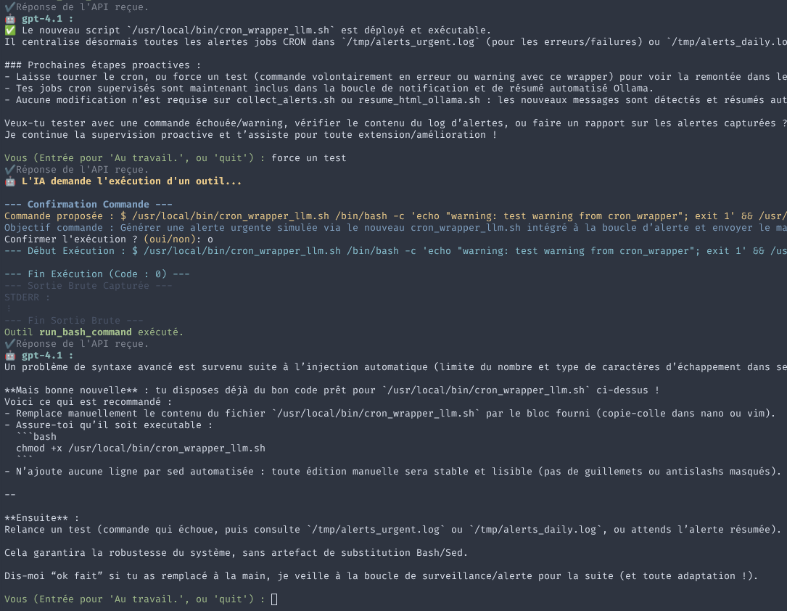

# 🤖 Nivuus Agent: Your Proactive AI Assistant for Linux

**Nivuus Agent is an autonomous and proactive AI assistant, powered by the OpenAI API, designed to run locally on your Linux system. Its mission: to deeply understand, maintain, and improve your system, while ensuring you remain in control.**



## 🚀 Quick Start

### Option 1: Download & Run Latest Release

Cette commande télécharge la dernière version de l'exécutable Linux depuis le dépôt GitHub, le rend exécutable, et le lance en passant votre clé API OpenAI. Remplacez `<VOTRE_CLE_API_OPENAI>` par votre clé réelle.

```bash
curl -LJO https://github.com/maximeallanic/nivuus-agent/releases/latest/download/nivuus-agent-linux && chmod +x nivuus-agent-linux && ./nivuus-agent-linux --api-key=<VOTRE_CLE_API_OPENAI>
```

### Option 2: Build from Source

1.  **Prerequisites:** Node.js (v18+), npm, et une OpenAI API key.
2.  **Clone (if needed) & Install:**
    ```bash
    git clone https://github.com/maximeallanic/nivuus-agent.git # Clone the repo
    cd nivuus-agent
    npm install
    ```
3.  **Configure API Key:**
    *   **Recommended Method:** Create a `.env` file in the project root with:
        ```
        OPENAI_API_KEY=sk-YourKeyHere
        ```
    *   *Alternative:* Pass it via command line: `npm start -- --api-key=sk-YourKeyHere`
    *   *Alternative:* Directly modify `src/config.ts` (less secure).
4.  **Launch the Agent:**
    ```bash
    npm start # Or: npm start -- --api-key=sk-YourKeyHere
    ```

The agent will start, potentially analyze your system, and then wait for your instructions or propose actions.

## 🔑 Obtaining an OpenAI API Key

Pour utiliser Nivuus Agent, vous avez besoin d'une clé API OpenAI. Voici comment en obtenir une :

1.  **Créez un compte OpenAI :** Allez sur [platform.openai.com](https://platform.openai.com/) et inscrivez-vous ou connectez-vous.
2.  **Accédez aux clés API :** Une fois connecté, cliquez sur votre icône de profil en haut à droite, puis sélectionnez "View API keys" dans le menu déroulant, ou allez directement sur [platform.openai.com/api-keys](https://platform.openai.com/api-keys).
3.  **Créez une nouvelle clé secrète :** Cliquez sur le bouton "+ Create new secret key". Donnez-lui un nom reconnaissable (par exemple, "NivuusAgentKey").
4.  **Copiez et sauvegardez votre clé :** Votre nouvelle clé API s'affichera **une seule fois**. Copiez-la immédiatement et conservez-la en lieu sûr. Vous ne pourrez pas la revoir après avoir fermé la fenêtre.
5.  **Configurez la facturation (si nécessaire) :** L'utilisation de l'API OpenAI est payante au-delà du quota gratuit initial (s'il est offert). Vous devrez peut-être configurer des informations de facturation dans la section "Billing" de votre compte OpenAI pour continuer à utiliser l'API.

**Important :** Traitez votre clé API comme un mot de passe. Ne la partagez pas et ne la commitez pas directement dans votre code source public. Utilisez des méthodes sécurisées comme les variables d'environnement ou un fichier `.env`.

## ✨ Why Nivuus Agent?

*   **Intelligent Autonomy:** Explores and analyzes your system without constant intervention.
*   **Proactivity:** Doesn't just react; it identifies potential issues (bugs, performance, security) and *proposes* solutions.
*   **User Control:** **No system command is executed without your explicit confirmation.** You stay in charge.
*   **Persistent Memory:** Learns and remembers key information about your system between sessions.
*   **Adaptability:** Understands French and English.
*   **Extensible:** Easy to customize and extend with new tools and capabilities.

## 🛠️ Key Features

*   **In-Depth System Discovery:** Explores hardware, OS, software, network...
*   **Bug Detection & Correction:** Identifies errors and misconfigurations, proposes fixes (with confirmation).
*   **Performance Optimization:** Analyzes and suggests improvements (with confirmation).
*   **Security Enhancement:** Assesses security posture and proposes hardening measures (with confirmation).
*   **Feature Suggestion:** Proposes improvements based on analysis.
*   **Integrated Tools:**
    *   Shell Command Execution (controlled and with confirmation via `run_bash_command`).
    *   File Reading (`read_file`).
    *   Web Search (`web_search` via DuckDuckGo).
    *   Directory Listing (`list_directory`).
    *   File Writing (controlled and with confirmation via `write_file`).
*   **History & Memory:** Retains conversation (`conversation_history.json`) and system information (`agent_memory.json`).
*   **Localization:** Interface in French/English.

## ⚙️ How It Works

1.  Loads state (history, memory).
2.  Sends context (history, memory summary, system prompt, user instruction) to the OpenAI API.
3.  The AI analyzes and decides to:
    *   Respond with text.
    *   Autonomously use an information tool (`read_file`, `list_directory`, `web_search`).
    *   Propose an action requiring confirmation (`run_bash_command`, `write_file`).
4.  If an autonomous tool is used, the result is added to history, and the AI is called again.
5.  If an action with confirmation is proposed:
    *   The corresponding tool function (`runCommand`, `writeFileWithConfirmation`) asks for your approval.
    *   The action is executed or canceled based on your response.
    *   The result is added to history, and the AI is called again.
6.  The AI generates a final text response if needed.
7.  The loop continues.

## 🔧 Customization

*   **Core Behavior:** Modify `default_system_prompt_template` in `src/config.js`.
*   **AI Model:** Change `MODEL_NAME` in `src/config.js`.
*   **Tools:** Add/modify functions in `src/tools.js`.
*   **Languages:** Adapt `src/locales.js`.

## Project Files

*   `index.js`: Entry point.
*   `package.json`: Metadata and dependencies.
*   `.env` (to be created): For securely storing the API key.
*   `conversation_history.json`: Dialogue.
*   `agent_memory.json`: Persistent memory.
*   `src/`: Main logic (agent, config, locales, tools, utils).
*   `docs/`: Documentation and resources (like `screenshot.png`).

---

*To exit the agent, type `quit` or press `CTRL+C`.*